## Overview

> Can a noisy, multichannel biological signal reveal a person's communicative intention before the person starts speaking?

This project analyzed electroencephalography (EEG) data recorded while participants produced the same kinds of one-word utterances in two different communicative contexts:

- **Naming** an object, as in a language test.
- **Requesting** an object, as in a shop interaction.

Because the spoken words and much of the physical setup were closely controlled across conditions, the central analytical challenge was to determine whether the context and intended function of the utterance were reflected in brain activity before speech onset. From a data-science perspective, this is a high-dimensional time-series problem involving noisy sensor data, event alignment across modalities, artifact detection, quality-control rules, repeated-measures data, multiple-comparison correction, and robustness checks.

Further resources:

- **Publication:** Boux, I., Tomasello, R., Grisoni, L., & Pulvermüller, F. (2021). Brain signatures predict communicative function of speech production in interaction. Cortex, 135, 127–145. [https://doi.org/10.1016/j.cortex.2020.11.008](https://doi.org/10.1016/j.cortex.2020.11.008)

## Data Collection

Participants interacted face-to-face with a member of the research team while sitting on opposite sides of a table. In each trial, two real objects were placed in front of them. After an auditory cue, participants selected one object, fixated a central point for several seconds, and then produced a single-word utterance. The same basic task was performed in two communicative contexts:

- In the **naming** condition, participants imagined taking a language test and named the selected object for an examiner.
- In the **request** condition, they imagined being customers in a shop and requested the object from a salesperson.

The experimental setup, objects, interaction partner, and spoken words were kept as similar as possible across conditions, allowing the analysis to focus on differences related to communicative intention.

The study combined EEG recordings and speech audio collected during a controlled social interaction.

- **EEG (electroencephalography)** is a non-invasive technique that measures changes in electrical activity at the scalp using multiple electrodes. Brain activity was recorded with 64 active electrodes positioned over the scalp using a standard EEG cap; several electrode positions were additionally used to monitor eye movements for later artifact detection.
- **Speech** was recorded continuously.

## Preprocessing Pipeline

The 64-channel EEG data were preprocessed according to standard event-related potential practices. The aim was to transform a continuous signal recorded across 64 channels into averaged brain responses preceding each spoken word. For this purpose, the audio waveform was inspected to determine the exact onset of each spoken word. These voice-onset timestamps were aligned with the EEG recordings, providing a common temporal reference for analyzing neural activity immediately before speech production.

```mermaid
flowchart TD

subgraph A["Data Acquisition"]
    A1["64-channel EEG<br/>active electrodes"]
    A2["Sampling rate: 500 Hz"]
    A1 --> A2
end

subgraph B["EEG signal cleaning"]
    B1["Downsampling<br/>500 -> 250 Hz"]
    B2["Filtering<br/>Band-pass filter: 0.1-30 Hz"]
    B3["Compute vertical and horizontal EOG signals<br/>from ocular electrodes"]
    B4["Visual channel QC<br/>remove noisy EEG channels"]
    B5["ICA decomposition<br/>35 components"]
    B6{"Artifact component?"}
    B7["Ocular artifact<br/>abs(r) > 0.3 with EOG"]
    B8["Articulation / muscle artifact<br/>abs(r) > 0.3 with FT7, FT8,<br/>or lower EOG"]
    B9["Remove component"]
    B10["Retain component"]
    B11["Reconstruct cleaned EEG"]
    B12["Interpolate removed channels"]

    B1 --> B2 --> B3 --> B4 --> B5 --> B6
    B6 -->|ocular| B7 --> B9
    B6 -->|muscle / articulation| B8 --> B9
    B6 -->|no| B10
    B9 --> B11
    B10 --> B11
    B11 --> B12
end

subgraph G["Audio Acquisition"]
    G1["1-channel audio recording"]
end

subgraph C["Audio preprocessing"]
    C1["Inspect audio waveform"]
    C2["Visually detect voice onset<br/>for each trial"]
    C3["Validate spoken response<br/>keep correct trials only"]
    C1 --> C2 --> C3
end

subgraph D["Signal segmentation"]
    D1["Align voice-onset markers<br/>with cleaned EEG"]
    D2["Response-locked segmentation<br/>-2000 to +500 ms"]
    D3["Baseline correction<br/>-2000 to -1800 ms"]
    D4["Reject trials exceeding ±150 uV<br/>before voice onset"]
    D5["Participant-level QC<br/>exclude datasets with excessive trial loss<br/>or extreme ERP values"]
    D1 --> D2 --> D3 --> D4 --> D5
end

subgraph E["Averaging"]
    E1["Average by subject and condition<br/>2 conditions: naming, requesting"]
    E2["Grand average across subjects"]
    E1 --> E2
end

subgraph H["Feature Extraction"]
    H1["Extract and average signal in selected time windows<br/>relative to speech onset:<br/>TW1: −1000 to −800 msec,<br/>TW2: −800 to −600 msec,<br/>TW3: −600 to −400 msec,<br/>TW4: −400 to −200 msec,<br/>TW5: −200 to 0 msec"]
    H2["Extract 9 spatial locations<br/>left anterior (LA: F7, F5, F3, FC5)<br/>midline anterior (MA: F1, Fz, F2, FCz)<br/>right anterior (RA: F4, F6, F8, FC6)<br/>left central (LC: T7, C5, C3, CP5)<br/>midline central (MC: C1, Cz, C2, CPz)<br/>right central (RC: C4, C6, T8, CP6)<br/>left posterior (LP: P7, P5, P3, PO7)<br/>midline posterior (MP: P1, Pz, P2, POz)<br/>right posterior (RP: P4, P6, P8, PO8)"]
    H3["Select broad pre-speech time window<br/>-1000 ms to speech onset"]
    H4["Select broad channel set:<br/>F7, F5, F3, F1, Fz, F2, F4, F6, F8,<br/>FC5, FC3, FC1, FCz, FC2, FC4, FC6,<br/>T7, C5, C3, C1, Cz, C2, C4, C6, T8,<br/>CP5, CP3, CP1, CPz, CP2, CP4, CP6,<br/>P7, P5, P3, P1, Pz, P2, P4, P6, P8, PO7, POz"]
    H1 --> H2
    H3 --> H4
end

subgraph F["Statistical Analysis"]
    F1["Repeated-measures ANOVA<br/>test condition effects on ERP amplitudes"]
    F2["Post hoc comparisons<br/>corrected"]
    F3["Cluster-based permutation test CBPT<br/>spatiotemporal clustering<br/>5000 permutations"]
    F4["Robustness CBPT<br/>restricted pre-speech window"]

    F1 --> F2
    F3 --> F4
end

A2 --> B1
G1 --> C1

B12 --> D1
C3 --> D1

D5 --> E1

E2 --> H1
H2 --> F1
E2 --> H3
H4 --> F3
```

## Results

The EEG data showed a clear difference between **requesting and naming conditions before speech onset**. As illustrated in **Figure 1 (top panel)**, requests elicited a stronger negative-going potential than naming, particularly over fronto-central electrodes. The cluster-based permutation test confirmed a significant difference between conditions (*p* = .003), with the strongest effect occurring approximately **430–130 ms before speech onset**.

The repeated-measures ANOVA supported this result, showing a significant main effect of communicative act (*p* = .015) and an interaction between communicative act and time window (*p* = .011). Post hoc comparisons showed that the conditions differed significantly during the final **600 ms before speech production**, with requests consistently producing greater negativity.

The spatial distribution of the effect is visible in **Figure 1 (bottom panel)**: the pre-speech negativity was strongest over **fronto-central scalp regions**, with a polarity reversal over posterior electrodes. Together, the analyses indicate that EEG activity can distinguish the communicative function of an upcoming utterance several hundred milliseconds before the speaker begins to talk.

    

        
    

    

        
    

    [Figure 1] Pre-speech EEG differences between requesting and naming. Top panel: Grand-average ERP waveforms for the two communicative conditions, showing a stronger negative-going potential for requests before speech onset. Bottom panel: Scalp distribution of the request–naming difference, highlighting a predominantly fronto-central effect with posterior polarity reversal. Both panels are taken from Boux et al. (2021) and were originally published under a CC BY license.

## Conclusion

> This project shows that communicative intent leaves a measurable signature in brain activity even before speech begins.

## Tech Stack

Software and libraries:

- `Python` and the `PsychoPy` library for coordinating the EEG and audio acquisition
- `MATLAB` and the `EEGLAB` toolbox for preprocessing and visualizing EEG data
- `STATISTICA` software for inferential statistics
- `Audacity` for audio processing
