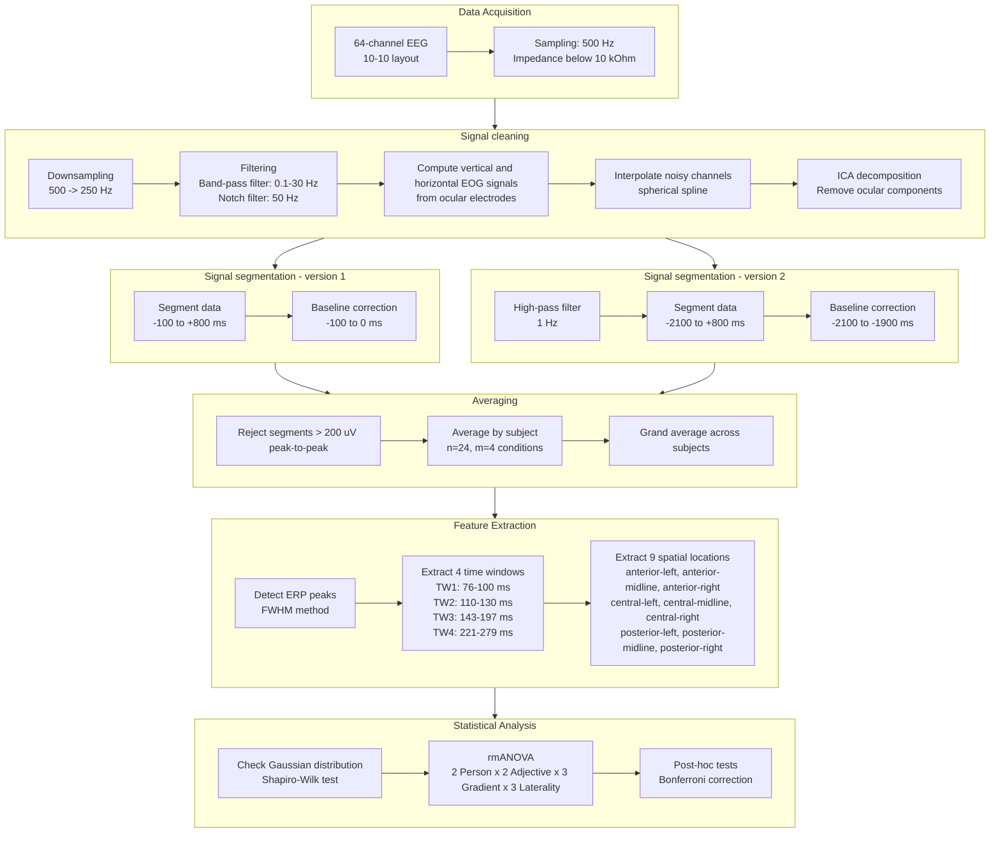

## Overview
This study investigated how quickly the brain recognizes the communicative function of emotion-related utterances. Using EEG, we compared brain responses to expressive sentences such as *“I am happy”* which communicate the speaker’s emotional state, with similar assertive sentences such as *“he is happy”* which report information about someone else. The results showed very early neural differences between expressive and assertive communicative actions, suggesting that pragmatic meaning, that is the communicative intent of language, is processed rapidly and in parallel with other aspects of language comprehension.

Further resources:
* **Publication**: Boux, I. P., Osterloh, M. R., Tomasello, R., Grisoni, L., & Pulvermüller, F. (2026). Instantaneous emotion sharing: early brain signatures of understanding expressive communicative actions. Neuropsychologia, 109395. [https://doi.org/10.1016/j.neuropsychologia.2026.109395](https://doi.org/10.1016/j.neuropsychologia.2026.109395)

## Problem
Can we detect *communicative intent* (e.g., expressing emotion vs stating facts) directly from elecrophysiological brain signals (EEG) — and how early does this differenciation occurs in the language comprehension process?

---

## Data collection

- **Participants:** 24 subjects (after exclusions)
- **Signals:** 64-channel electroencephalography (EEG)
- **Sampling rate:** 500 Hz

    

        
    

    [Figure 1]: Illustration of the EEG data collection system. (Image generated by chatGOT by OpenaAI.)

While EEG is being recorded, participants are seated in front of a computer and take part to a passive computerized task, where they have to read the presented text. The text consists of 270+ sentences that result form crossing two independent factos: `grammatical person` (1st and 3rd) and `adjective type` (emotional vs. physical) in a 2 x 2 experimentla design. This effectively resuts in 4 types of sentences, for instance:
- **1st/emotional**: *"I am happy."* (expressive)
- **3rd/emotional**: *"He is happy."* (assertive)
- **1st/physical**: *"I am blonde."* (assertive)
- **3rd/physical**: *"He is blonde."* (assertive)

Importantly, the **expressive** communication is instantiated only in the **"1st/emotional"** case as also confirmed by validation rating by an independant sample of participants.

---

## Preprocessing Pipeline

The EEG data from the 64-channels is preprocessed according to standard event-related-portential practice. The aim is to go from a continuous signal from 64 channels, to average brain responses to the critical word (*happy* or *blonde*). 

---

## Results

EEG data is multidimensional: it extends in time (ms elapsed since the word of interest appeared on screen) and space (64 channels measuing signal across the head). the first step was to narrow down the time dimension and identify time windows of interest. To thi spurpose, the EEG signall across all channels and subjects was averaged into one unieuq signal. Th epeaks and troughs in this signal were identified using the full width half maximum approach (FWHM). This resulted in the identification of four time windows of interest:
- **TW1**: 76–100 ms
- **TW2**: 110–130 ms
- **TW3**: 143–197 ms
- **TW4**: 221–279 MS

    

        
    

    [Figure 1]: Figure and legend taken from Boux et al. (2026). Grey boxes indicate the four unbiased data-driven time windows defined around each peak using the FWHM method. The yellow boxes indicate the three a priori time windows taken from the literature, capturing the N400, early P600 (eP600) and late P600 (lP600). The upper banner shows the average topographical maps obtained for each of these time windows.

The second step, was to simplify the spatial dimension of the EEG data. To do so, we split the spatial component into two dimensions or factors:
- `gradient`: anterior, central, posterior
- `laterality`: left, midline, right
This resulted in 9 selsction so felectrodes:
- anterior/left
- anterior/midline
- anterir/right
- central/left
- central/midline
- central/right
- posterior/left
- posterior/midline
- posterior/right

[IMAGE]

After identifying channel poolings of interets and time window of interest, we aimed at assesing where amon these time windos and electrode susets the we would dtect a dissociation between exrpressives and aserives. this dissociation is assessed by a **repeated-measures ANOVA** with the following factors, carried out separately in the 4 time windows of interest:
  - `Person`: 1st vs 3rd
  - `Adjective`: emotional vs physical
  - `Gradient`: anterior, central, posterior
  - `Laterality`: left, midline, right

The expected key interaction between `Person` and `Adjective` was detected in TW1 and TW4 indicatin

    

        
    

    [Figure 2]: Figure and legend taken from Boux et al. (2026). Main results of the grand-average event-related brain potentials across all subjects (n = 24) in the relevant time windows (TW). Grey boxes indicate the four unbiased data-driven time windows defined around each peak using the FWHM method. The yellow boxes indicate the three a priori time windows taken from the literature, capturing the N400, early P600 (eP600) and late P600 (lP600). Asterisks indicate statistical significance according to the established standards (∗ indicates p < 0.05, ∗∗ indicates p < 0.01, ∗∗∗ indicates p < 0.001). (A) Grand-average event-related potentials at the medial subset (P1, Pz, P2, POz) of posterior electrodes, best illustrating the dynamics of the Person × Adjective interaction. Note that the effect was in fact significant on a larger set of posterior and central electrodes, see panel C of this figure. Data-driven time-windows are indicated as grey boxes whereas a priori time windows are indicated as yellow boxes. The asterisks indicate the time windows where a two-way or higher-level interaction involving the factors Person and Adjective was detected in the rmANOVA. (B) Post-hoc analysis of the potentials averaged in TW1. The dot plots indicate the averaged potentials within the time window both in the pre-word-baseline (upper panel) and pre-sentence baseline data (lower panel), with the error bars representing the SEM across subjects. The asterisks indicate statistical significance between conditions after Bonferroni correction for 4 comparisons. The topographical plots display the grand average potential distributions across the scalp in TW1 for each of the four conditions of the pre-word-baselined data. (C) Post-hoc analyses of the potentials averaged in TW4. The dot-plots indicate the averaged potentials within the time window at the anterior (F7, F5, F3, FC5, F1, Fz, F2, FCz, F4, F6, F8, FC6), central (T7, C5, C3, CP5, C1, Cz, C2, CPz, C4, C6, T8, CP6) and posterior (P7, P5, P3, PO7, P1, Pz, P2, POz, P4, P6, P8, PO8) electrode poolings both in the pre-word-baseline (upper panel) and pre-sentence baseline data (lower panel), with error bars representing SEMs across subjects. The asterisks indicate statistical significance between conditions after Bonferroni correction for 12 comparisons. The topographical plots display the grand average potential distributions across the scalp in TW4 for each of the four conditions of the pre-word-baselined data..

- Significant interaction effect at **~250 ms post-stimulus** :contentReference[oaicite:0]{index=0}  
- Strongest signal over **posterior electrodes**
- Interpretation:
  - Brain differentiates *intent* before surprisingly early and in parallel with (i.e. not after) classical semantic processing stages.

---

## Tech Stack

Python
- `numpy`
- `mne-python`
Signal processing
- filtering
- indpendent component analysis (ICA)
Statistical modeling and inferential statistics
- repeated measure ANOVA in `STATISTICA`
- interaction effects
- post-hoc tests
Experimental design:
- 2 x 2 factorial design
- control for extraneous variables