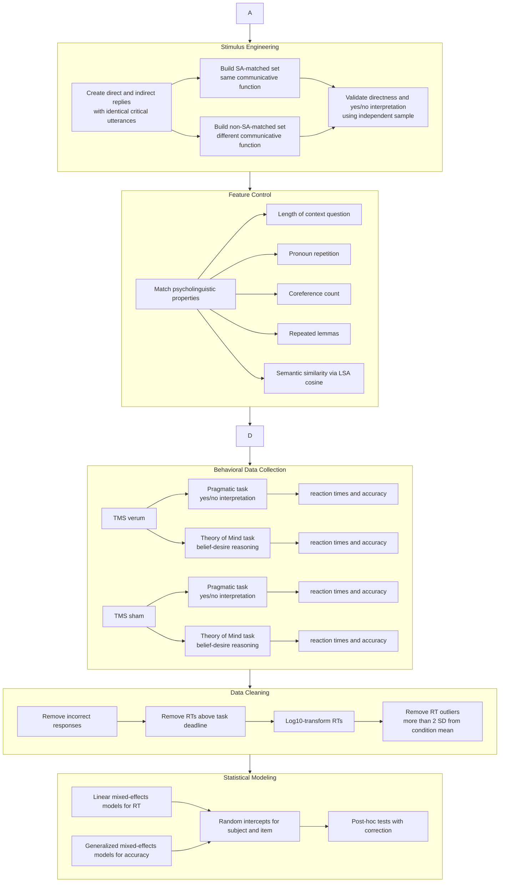

## Overview

This project investigated how the brain supports the interpretation of indirect communication, such as understanding implied meaning rather than only literal words. The study focused on the right temporo-parietal junction, a brain region associated with Theory of Mind and social reasoning, and used transcranial magnetic stimulation to test its causal role in pragmatic language comprehension.

The work involved analyzing behavioral reaction-time and accuracy data across experimental conditions, comparing responses to direct and indirect speech acts, and interpreting how brain stimulation affected language-processing performance. The results showed that indirect meaning is not explained by a single brain region alone; instead, the right temporo-parietal junction may be especially relevant when language carries a social communicative function, such as accepting or rejecting an offer.

Further resources:
* **Peer-reviewed scientific publication**: Boux, I. P., & Pulvermüller, F. (2023). Does the right temporo-parietal junction play a role in processing indirect speech acts? A transcranial magnetic stimulation study. Neuropsychologia, 188, 108588. [https://doi.org/10.1016/j.neuropsychologia.2023.108588](https://doi.org/10.1016/j.neuropsychologia.2023.108588).

---

## Research Question

Indirect speech acts are cases where speakers communicate more than the literal sentence says. For example, in response to *“Did you bring your cat to the vet?”*, the sentence *“It got wounded”* can indirectly mean YES.

It has been claimed that understanding such indirect speech acts relies more strongly on **Theory of Mind (ToM)**, that is, the human capacity to infer and process the thoughts of other people. ToM has been shown to be linked to a specific brain circuit including the **right temporo-parietal junction (rTPJ)**.

> **So, does the right temporo-parietal junction (rTPJ), a brain region associated with Theory of Mind (ToM), play a causal role in understanding indirect speech acts? If so, altering activation of this brain area while people are exposed to indirect speech acts should change their ability to understand them. In a complementary fashion, this should also alter their ToM capability.**

A key methodological challenge was **confounding**. Previous studies often compared direct and indirect utterances that differed not only in indirectness, but also in **speech act type**. For example, a direct *statement* might be compared with an indirect *request*. This makes it unclear whether observed behavioral or neural effects are caused by indirectness itself or by the communicative function of the sentence (*statement* as opposed to a *request*). 
This study addressed that issue by designing two stimulus sets:
* **Speech-act matched:** direct and indirect replies had the same communicative function, that is, they were both *statements*.
* **Speech-act non-matched:** direct and indirect replies differed in communicative function, mimicking earlier research designs. The direct speech act was always a *statement*, whereas the indirect one would vary (*accepting an offer*, *declining an offer*, etc.).

<div class="row justify-content-sm-center">
    <div class="col-sm-8 mt-3 mt-md-0">
        
    </div>
</div>
<div class="caption">
    Image by ChatGPT (OpenAI).
</div>

---

## Data Collection

Data was collected from 27 native English-speaking participants who took part in two distinct behavioral tasks. But how do we alter brain activity? And how do we measure people's ability to understand indirect speech acts and use ToM skills?


  **METHOD 1: Altering brain activity: transcranial magnetic stimulation**

  Changing the level of brain activity is possible using a method called **transcranial magnetic stimulation (TMS)**. Conveniently, this method is non-invasive (not painful, with no need for surgery) and temporary, meaning that the resulting changes in brain activity last only a few minutes.

  Our participants came to the lab for two sessions (in randomized order):
  * **real session**: TMS is truly delivered to their brain 
  * **fake session**: TMS is not truly delivered to their brain, although they believe so.
  Having these two types of session allowed us to experimentally control for nonspecific effects of TMS, such as placebo effects.

  The TMS manipulation in itself does not deliver data. Instead it is expected to affect the data from the following two tasks.

  <div class="row justify-content-sm-center">
      <div class="col-sm-8 mt-3 mt-md-0">
          
      </div>
  </div>
  <div class="caption">
      Generated with ChatGPT by Openai.
  </div>

  **METHOD 2: Measuring the ability to understand indirect speech acts with the *Pragmatic Interpretation Task***

  After the participants underwent real or sham TMS, we measured how well they could understand direct and indirect speech acts. To do so, we placed the participants in front of a computer screen where they saw a total of 264 question-reply pairs, one by one. For each question-reply pair, the participant was asked to judge whether the reply meant YES or NO and to press one of two keys accordingly, doing so as quickly and accurately as possible.

  This means that we could collect two measures of the participants' ability to understand direct and indirect speech acts:
  * **accuracy (binary)**: did they correctly understand that the reply was meant as YES or NO?
  * **reaction times (continuous)**: how fast were they at making that decision. 

  We were interested in knowing whether these collected measures were affected by:
  * `In/Directness of the reply`: direct or indirect
  * `SA-matching`: matched vs. non-matched (see this other [project](https://isabellaboux.github.io/projects/iCO-Eval/) for more explanation)
  * `TMS Stimulation`: sham vs. verum TMS
  * `Session`: first vs. second

  **METHOD 3: Measuring the Theory of Mind ability with the *Hidden Food Task***

  This computerized task measured the participant's capacity to infer and process the thoughts of other people. Participants saw on a screen statements about the beliefs (*He thinks the doughnut is in the blue/red box*) and desires (*He loves/hates doughnuts*) of a fictional character, as well as statements about the truth (*The doughnut is in the blue/red box*). Based on what they knew about the character, they had to decide which box (red or blue) the fictional character was most likely to open.

  Again, we collected two measures of the participants' ability to process Theory of Mind:
  * **accuracy (binary)**: did they correctly predict the behavior of the fictional character?
  * **reaction times (continuous)**: how fast were they at making that decision. 

  For the **Theory of Mind task**, there were the following factors in a fully within-subjects design:
  * `Belief`: true vs. false
  * `Desire`: approach vs. avoidance
  * `TMS Stimulation`: sham vs. verum TMS
  * `Session`: first vs. second

---

## Preprocessing Pipeline



---

## Statistical modelling

The pragmatic-task model tested whether rTPJ stimulation changed the processing cost of indirect speech acts:

```text
log10(RT) ~ InDirectness * Stimulation * SA_matching
            + length
            + session
            + (1 | subject)
            + (1 | item)
```

For accuracy, the same predictor structure was analyzed using a generalized mixed-effects model.

The Theory of Mind task tested whether TMS affected ToM-related belief-desire reasoning:

```text
log10(RT) ~ Belief * Desire * Stimulation
            + session
            + (1 | subject)
            + (1 | item)
```

---

## Results

**Indirect speech acts were slower than direct speech acts under sham TMS**, confirming that they are in general more complex to process. This delay appeared both when speech acts were matched and when they were not matched, showing that indirectness itself creates measurable behavioral cost.

**rTPJ stimulation changed the pattern only for non-SA-matched stimuli**. Under verum TMS, the delay for indirect replies remained significant in the **SA-matched** condition. However, in the **non-SA-matched** condition, the indirect-vs-direct reaction-time difference was no longer reliable. This suggests that the rTPJ is not causally involved in indirectness alone. Instead, its role appears stronger when indirectness is combined with a change in communicative function, such as moving from factual answering to accepting or rejecting an offer.

<div class="row">
    <div class="col-sm mt-3 mt-md-0">
        
    </div>
    <div class="col-sm mt-3 mt-md-0">
        
    </div>
</div>
<div class="caption">
    The large panel illustrates the average RTs (by subject) from the pragmatic task in the sham TMS condition plotted by SA-matching and In/Directness, illustrating the significant effect of In/Directness. The small panel illustrates the average difference in RTs found in the sham data between direct and indirect conditions (indirect > direct), separately by SA-matching. Error bars indicate the standard error of the mean (SEM) by subject. * indicates p < 0.05, ** indicates p < 0.01, *** indicates p < 0.001.

    The large panel illustrates the average RTs (by subject) from the pragmatic task following verum TMS plotted by SA-matching and In/Directness, illustrating the significant interaction effect between In/Directness and SA-matching. The small panel illustrates the average difference in RTs found in the verum data between direct and indirect conditions (indirect > direct), separately by SA-matching. Error bars indicate the standard error of the mean (SEM) by subject. * indicates p < 0.05, ** indicates p < 0.01, *** indicates p < 0.001.
</div>

**The Theory of Mind task worked as a baseline (with sham TMS)** because it showed the expected effects. False-belief trials were slower than true-belief trials. Avoidance-desire trials were slower than approach-desire trials. Belief and desire interacted such that false-belief and avoidance-desire trials were the most time costly.

**Verum TMS affected Theory of Mind task performance**. It reduced reaction times in some ToM-relevant conditions, suggesting that stimulation did affect ToM-related processing.

<div class="row justify-content-sm-center">
    <div class="col-sm-8 mt-3 mt-md-0">
        
    </div>
</div>
<div class="caption">
     The large panel illustrates the reaction time data from the Theory of Mind task separated by Belief and Desire, where B+: true belief, B-: false belief, D+: approach desire, and D-: avoidance desire. The small panel illustrates the difference in reaction times between verum and sham conditions (verum > sham) by Belief and Desire. In all panels, error bars indicate the standard error of the mean (SEM) by subject. Stars indicate significance levels (* indicates p < 0.05, ** indicates p < 0.01, *** indicates p < 0.001).
</div>

---

## Conclusion

The study did **not** find evidence that the rTPJ is causally necessary for processing indirectness per se. Instead, the results support a more nuanced interpretation:

> rTPJ-mediated Theory of Mind may be especially relevant when indirectness is combined with a change in speech-act function, such as accepting or rejecting an offer, rather than when direct and indirect utterances perform the same communicative function.

---

## Tech Stack

* **Matlab**
  * `Psychtoolbox 3` for experimental task presentation.
* **Python 3.6**
  * `pandas` for data manipulation and preprocessing
  * `seaborn` for visualization 
* **R**
  * `lme4` for linear and generalized mixed-effects models.
  * `lmerTest` for significance testing with Satterthwaite degrees of freedom.
  * `emmeans` for post-hoc comparisons.
* **Experimental methods**
  * Repetitive transcranial magnetic stimulation.
  * Sham-controlled within-subject design.
  * Reaction-time and accuracy modeling.
* **Statistical methods**
  * Linear mixed-effects modeling.
  * Logistic mixed-effects modeling.
  * Interaction effects.
  * Post-hoc contrasts.
  * Outlier removal.
  * Log transformation.
* **NLP / linguistic feature control**
  * Latent Semantic Analysis (cosine similarity).
  * Lemma repetition counts.
  * Pronoun repetition counts.
  * Coreference counts.
  * Sentence-length matching.
