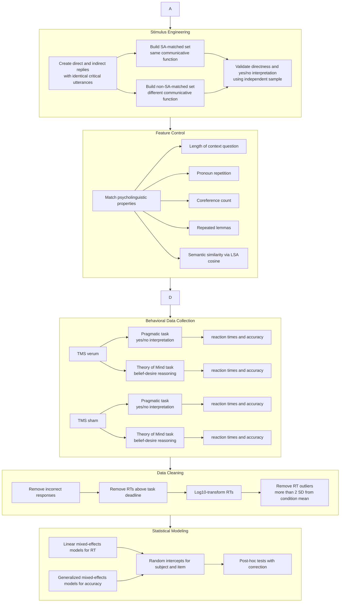

# Overview

# STEP 1: Research Question

Indirect speech acts are cases where speakers communicate more than the literal sentence says. For example, in response to *“Did you bring your cat to the vet?”*, the sentence *“It got wounded”* can indirectly mean YES.

It has been claimed that understanding such indiretc speech acts relies more strongly on **Theory of Mind (ToM)**, that is the human capacity to infer and process the thoughts of other people. ToM has been shown to be linked to a specific brain circuit including the **right temporo-parietal junction (rTPJ)**.

**So, does the right temporo-parietal junction (rTPJ), a brain region associated with Theory of Mind (ToM), play a causal role in understanding indirect speech acts? If so, altering activation of this brian area while people are exposed to indirect speech acts should change their ability to understand them. In a complementary fashion, this should also alter their ToM capability.**

A key methodological challenge was **confounding**. Previous studies often compared direct and indirect utterances that differed not only in indirectness, but also in **speech act type**. For example, a direct *statement* might be compared with an indirect *request*. This makes it unclear whether observed behavioral or neural effects are caused by indirectness itself or by the communicative function of the sentence (*statement* as opposed to a *request*). 
This study addressed that issue by designing two stimulus sets:
* **Speech-act matched:** direct and indirect replies had the same communicative function, that is they wer both *statements*.
* **Speech-act non-matched:** direct and indirect replies differed in communicative function, mimicking earlier research designs. The direct speech act was always a *statement* whereas the indirect one would vary (*accepting an offer*, *declining an offer*, etc).

<div class="row justify-content-sm-center">
    <div class="col-sm-8 mt-3 mt-md-0">
        
    </div>
</div>
<div class="caption">
    Image by ChatGPT (OpenAI).
</div>

---

# STEP 2: Methods and Data Collection

But how do we alter brain activity? And how do we measure people's ability to understand indirect speech acts and to use ToM skills? 

Data came from 27 human english-native speaker participants who took part in two disctinct behavioral tasks.

**> Altering brain activity: transcranial magnetic stimulation**

Changing the level of brain activityy is possible using a method called **transcranial magnetic stimulation(TMS)**. Conveniently, this method is non-invasive (not painful, no need for surgery) and temporary, meaning that the resulting changes in brain activity only last few minutes.

Our participants come for the lab for two sessions (in randmoized order):
* **real session**: TMS is truly delivered to their brain 
* **fake session**: TMS is not truly delivered to their brain, although they believe so.
Having these two types of session allows to experimentally control for unspecific effects of TMS (for instance for the placebo effect).

[IMAGE]

**> Measuring the ability to understand indirect speech acts: pragmatic interpretaion task**

Afrer our participants undergo (real or fake) TMS, we measrue how well they can understand indirect speech acts. To do so, we place the participants in front of a computer screen where a question is displayed and after a few seconds the reply is replaced. There are two types of reply:
* **direct replies** 
* **indirect replies**
We do so for many question/reply pairs. Each time, the participant is asked to judge whether the reply means YES or NO and to press one of two keys accordingly. This means that we can collect two measures about the paricipants' ability to understand direct and indirect speech acts:
* **accuracy**: did they correctly understood that he reply was meant as YES or NO.
* **reaction times**: how fast were they at making that decision. 


**Pragmatic interpretaion task:** 
  * Participants read question–reply pairs, for a total of 132 trials.
    * **SA-matched set:** 70 direct/indirect item pairs.
    * **Non-SA-matched set:** 62 direct/indirect item pairs.
  * Half of each set required a “yes” interpretation and half required a “no” interpretation. Participants judged whether the reply meant “yes” or “no”.
  * Collected measures:
    * accuracy (how correct were the participants)
    * reaction times (how fast were participants' responses).


**> Measuring the Theory of Mind ability**

* **Theory of Mind task:** 27 participants total.
  * Participants predicted a character’s behavior based on beliefs and desires.
  * Conditions crossed:
    * Belief: true belief vs false belief.
    * Desire: approach vs avoidance.
  * Theory of Mind task: 96 trials.

* **TMS:** The participants completed each task twice sessions:
  * Once in a **verum TMS** session, where TMS pulses were really delivered to their brain.
  * Once in a  **sham TMS** session, where no real TMS pulses were delivered.
  * Session order was counterbalanced.

### Experimental design

* **Experimental-design**
    * For the **Pragmatic interpretation task** there were following factors in a fully within-subjects design:
        * `InDirectness`: direct vs indirect.
        * `SA-matching`: speech-act matched vs non-matched.
        * `Stimulation`: sham vs verum TMS.
        * `Session`: first vs second.
    * For the **Theory of Mind task**  there were following factors in a fully within-subjects design:
        * `Belief`: true vs false.
        * `Desire`: approach vs avoidance.
        * `Stimulation`: sham vs verum TMS.
        * `Session`: first vs second.

---

### Preprocessing Pipeline



---

# Analysis approach

The analysis combined **experimental design, causal intervention, behavioral modeling, and mixed-effects statistics**.

The core response variable was **reaction time**, log-transformed to better satisfy Gaussian assumptions. Accuracy was analyzed separately as a binary outcome.

The pragmatic-task model tested whether rTPJ stimulation changed the processing cost of indirect speech acts:

```text
log10(RT) ~ InDirectness * Stimulation * SA_matching
            + length
            + session
            + (1 | subject)
            + (1 | item)
```

For accuracy, the same predictor structure was analyzed using a generalized mixed-effects model.

The Theory of Mind task tested whether TMS affected ToM-related belief-desire reasoning:

```text
log10(RT) ~ Belief * Desire * Stimulation
            + session
            + (1 | subject)
            + (1 | item)
```

Key data science choices:

* **Mixed-effects modeling** accounted for repeated observations from the same participants and repeated use of items.
* **Subject and item random intercepts** helped separate participant-level variability from stimulus-level variability.
* **Psycholinguistic controls** reduced confounding from sentence length, semantic similarity, lexical overlap, pronoun repetition, and coreference.
* **Sham stimulation** acted as a control condition.
* **Verum TMS** acted as a causal manipulation of rTPJ activity.
* **Counterbalancing** reduced order effects across sessions, tasks, and stimulus lists.
* **Post-hoc testing** was used to interpret significant interactions.

---

### Results

#### 1. Indirect speech acts were slower than direct speech acts under sham TMS

In the sham condition, participants were slower to respond to indirect replies than direct replies.

This replicated prior findings that indirect speech acts carry an additional processing cost.

Importantly, this delay appeared both when speech acts were matched and when they were not matched, showing that indirectness itself creates measurable behavioral cost.

#### 2. rTPJ stimulation changed the pattern only for non-SA-matched stimuli

Under verum TMS, the delay for indirect replies remained significant in the **SA-matched** condition.

However, in the **non-SA-matched** condition, the indirect-vs-direct reaction-time difference was no longer reliable.

This suggests that the rTPJ is not causally involved in indirectness alone. Instead, its role appears stronger when indirectness is combined with a change in communicative function, such as moving from factual answering to accepting or rejecting an offer.

#### 3. Accuracy was not the main driver

The pragmatic-task accuracy analysis did not reveal significant effects of the main experimental predictors.

This indicates that the main behavioral signal was in **processing speed**, not correctness.

#### 4. TMS affected Theory of Mind task performance

The Theory of Mind task showed expected effects:

* False-belief trials were slower than true-belief trials.
* Avoidance-desire trials were slower than approach-desire trials.
* Belief and desire interacted.

Verum TMS reduced reaction times in some ToM-relevant conditions, suggesting that stimulation did affect ToM-related processing.

#### 5. Main scientific conclusion

The study did **not** find evidence that the rTPJ is causally necessary for processing indirectness per se.

Instead, the results support a more nuanced interpretation:

> rTPJ-mediated Theory of Mind may be especially relevant when indirectness is combined with a change in speech-act function, such as accepting or rejecting an offer, rather than when direct and indirect utterances perform the same communicative function.

---

### Data Science Interpretation

This project demonstrates:

* **Causal inference in cognitive neuroscience:** using verum vs sham TMS to test whether a brain region contributes causally to behavior.
* **Careful confound control:** separating indirectness from speech-act function, a confound in much prior literature.
* **Experimental design under constraints:** repeated-measures design, counterbalancing, stimulus validation, and matched linguistic controls.
* **Hierarchical modeling:** using mixed-effects models to handle trial-level data nested within participants and items.
* **Behavioral signal extraction:** focusing on reaction time after cleaning, transformation, and outlier removal.
* **Feature engineering for language experiments:** using lexical overlap, coreference counts, pronoun repetition, sentence length, and LSA cosine similarity as controlled predictors.
* **Model interpretation:** distinguishing main effects from interactions and interpreting how causal manipulation changes condition contrasts.
* **Scientific skepticism:** showing that a previously assumed “indirectness” effect may partly reflect a confounded speech-act manipulation.
* **Transferable data science value:** the workflow resembles A/B testing with repeated observations, treatment-control comparison, feature balancing, hierarchical modeling, and interaction analysis.

For a data science portfolio, this project can be framed as an example of:

* designing a clean experiment,
* identifying and controlling confounds,
* modeling noisy human-response data,
* interpreting interaction effects,
* using causal perturbation to test a mechanistic hypothesis.

---

### Tech Stack

* **Matlab**

  * Psychtoolbox 3 for experimental task presentation.
* **Python 3.6**

  * Data preprocessing.
  * Statistical preparation.
  * General analysis workflow.
* **R**

  * `lme4` for linear and generalized mixed-effects models.
  * `lmerTest` for significance testing with Satterthwaite degrees of freedom.
  * `emmeans` for post-hoc comparisons.
* **Experimental methods**

  * Repetitive transcranial magnetic stimulation.
  * Sham-controlled within-subject design.
  * Reaction-time and accuracy modeling.
* **Statistical methods**

  * Linear mixed-effects modeling.
  * Logistic mixed-effects modeling.
  * Interaction effects.
  * Post-hoc contrasts.
  * Outlier removal.
  * Log transformation.
* **NLP / linguistic feature control**

  * Latent Semantic Analysis cosine similarity.
  * Lemma repetition counts.
  * Pronoun repetition counts.
  * Coreference counts.
  * Sentence-length matching.
